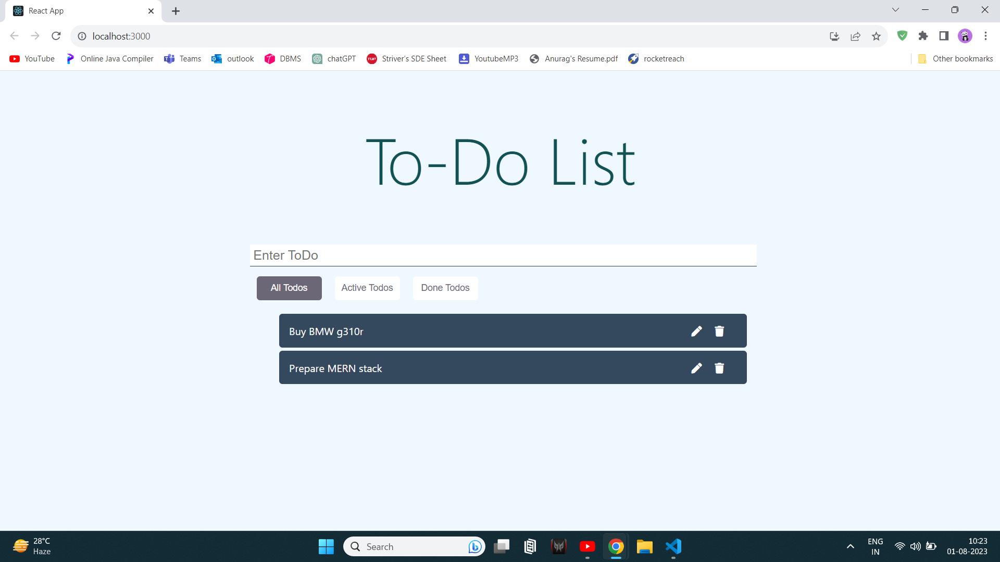
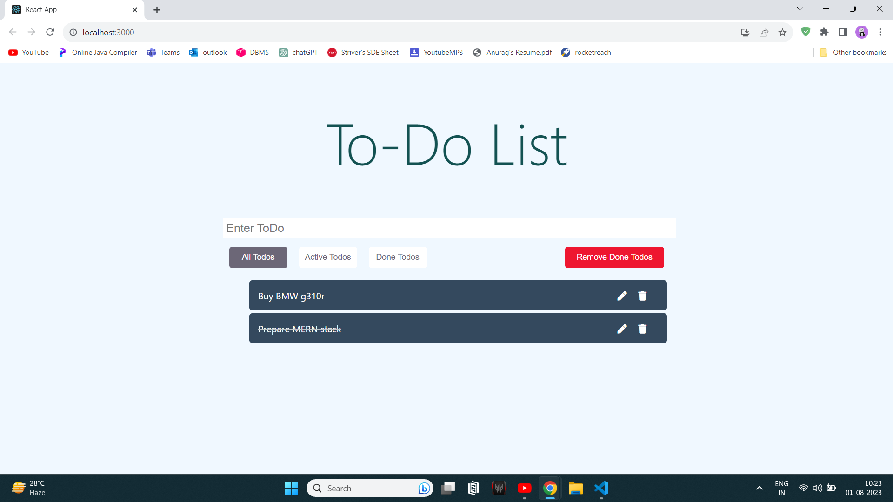
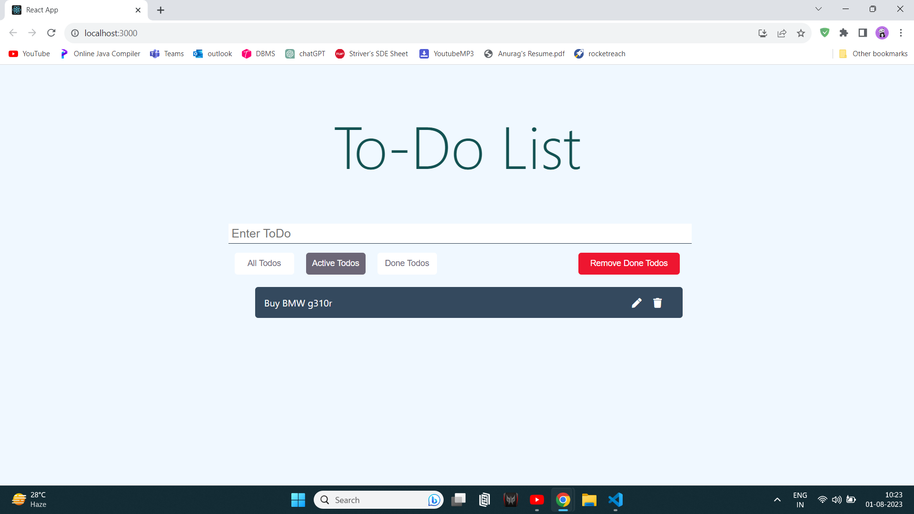
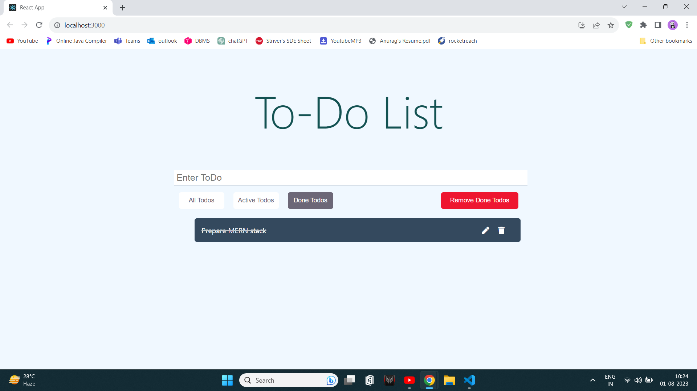

<!-- Intro  -->
<h3 align="center">
        <samp>&gt; Hey There!, I am
                <b><a target="_blank" href="https://alsiam.com">Anurag Komrewar</a></b>
        </samp>
</h3>

 
  <samp>
    <a href="https://anuragkomrewar.github.io/portfolio/">「 Google Me 」</a>
     
    「 I am a full stack web appplication developer 」
     
     
  </samp>

 
 
 
 
  
  

 

<!-- About Section -->
 # About me
 

 
  
 ✌️ &emsp; Enjoy to do programming and sharing knowledge   
 ❤️ &emsp; Love to writing code and learning new features  
 📧 &emsp; Reach me anytime: askomrewar@gmail.com  
 <!--💬 &emsp; Ask me about anything [here](https://github.com/alsiam/alsiam/issues)-->

 

## Tech Stack Used To Code

# <h1 align = "center">Responsive TodoList App</h1>
### <h3 align= "center">Made using complete MERN stack with redux</h1>
 &nbsp;  &nbsp; 
#
 &nbsp;  &nbsp; 
#
<!-- LICENSE -->
## License

MIT License

This project is licensed under the terms of the MIT License.
You can find a copy of the license in the LICENSE file or visit
https://opensource.org/licenses/MIT.

© [2023] [Anurag Komrewar]

(<a href="#readme-top">back to top</a>)

<!-- CONTACT -->
## Contact

Your Name - askomrewar@gmail.com

(<a href="#readme-top">back to top</a>)

<!-- ACKNOWLEDGMENTS -->
## Acknowledgments

I would like to express my gratitude to the following individuals and resources that have contributed to the development of this project:

* [GitHub Pages](https://pages.github.com)
* [Font Awesome](https://fontawesome.com)
* [React Icons](https://react-icons.github.io/react-icons/search)

(<a href="#readme-top">back to top</a>)

